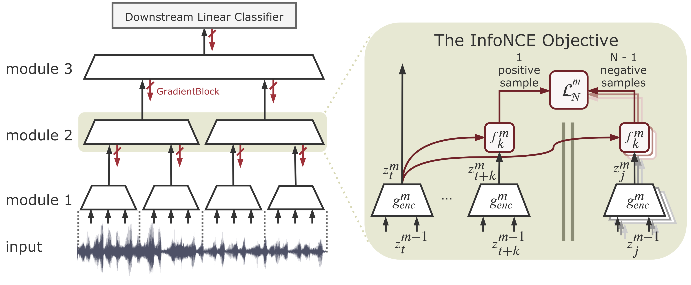
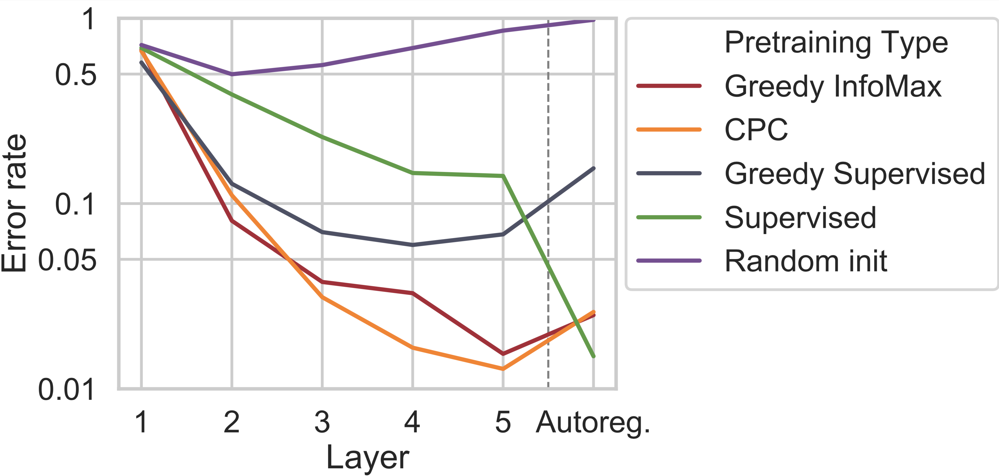

# Greedy InfoMax

We're going Dutch and explore greedy self-supervised training using the InfoMax principle. Surprisingly, it's competitive with end-to-end supervised training on certain perceptual tasks!

This repo provides the code for the audio experiments in our paper:

Sindy Löwe*, Peter O'Connor, Bastiaan S. Veeling* - [Greedy InfoMax for Biologically Plausible Self-Supervised Representation Learning](https://arxiv.org/abs/1905.11786)

&ast;equal contribution


## What is Greedy InfoMax?

We simply divide existing architectures into gradient-isolated modules and optimize the mutual information between cross-patch intermediate representations.





What we found exciting is that despite each module being trained greedily, it improves upon the representation of the previous module. This enables you to keep stacking modules until downstream performance saturates.

<p align="center">
    
</p>


## How to run the code

### Dependencies

- [Python and Conda](https://www.anaconda.com/)
- Create conda environment `infomax` by running:

    ```bash
    conda env create -f environment.yml 
    ```

- Install [torchaudio](https://github.com/pytorch/audio) in the `infomax` environment
- Download datasets into `./datasets/`
    * [Librispeech train-clean-100](http://www.openslr.org/12)
    * [LibriSpeech100_labels_split folder provided by Oord et al.](https://drive.google.com/drive/folders/1BhJ2umKH3whguxMwifaKtSra0TgAbtfb)


### Usage

- To replicate the audio results from our paper, run

    ``` bash
    source activate infomax
    bash audio_traineval.sh
    ```
    This will train the Greedy InfoMax model as well as evaluate it by training two linear classifiers on top of it - one for speaker and one for phone classification.
    
    

- View all possible command-line options by running

    ``` bash
    python -m GreedyInfoMax.audio.main_audio --help
    ```    
    
    Some of the more important options are:
    
    * in order to train the baseline CPC model with end-to-end backpropagation instead of the Greedy InfoMax model set: 
    ```bash
    --model_splits 1
    ```

    * If you want to save GPU memory, you can train layers sequentially, one at a time, by setting the layer to be trained (0-5), e.g.
    
    ```bash 
    --train_layer 0
    ```
    


## Cite

Please cite our paper if you use this code in your own work:

```
@article{lowe2019greedy,
  title={Greedy InfoMax for Biologically Plausible Self-Supervised Representation Learning},
  author={L{\"o}we, Sindy and O'Connor, Peter and Veeling, Bastiaan S},
  journal={arXiv preprint arXiv:1905.11786},
  year={2019}
}
```


## References 
- [Representation Learning with Contrastive Predictive Coding - Oord et al.](https://arxiv.org/abs/1807.03748)
